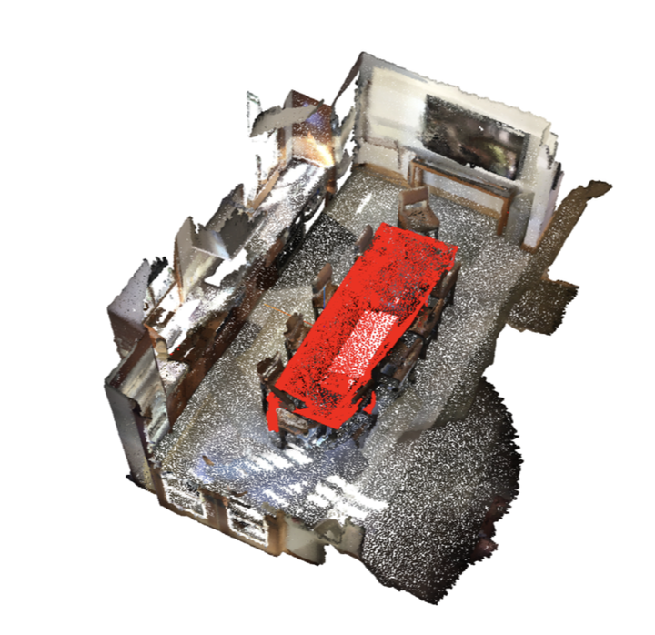
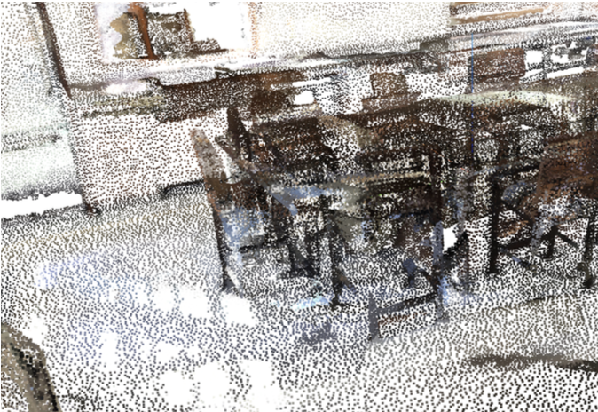
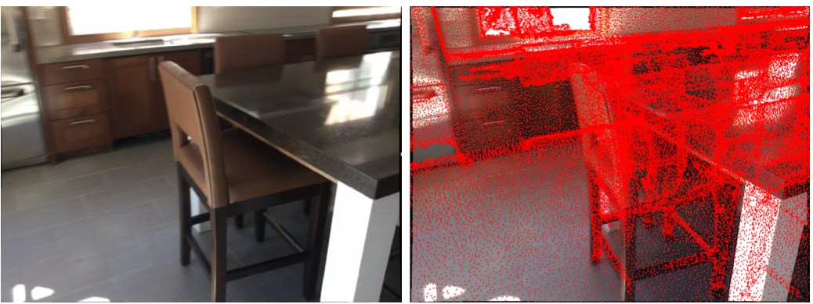
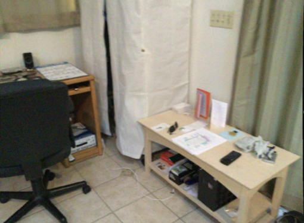
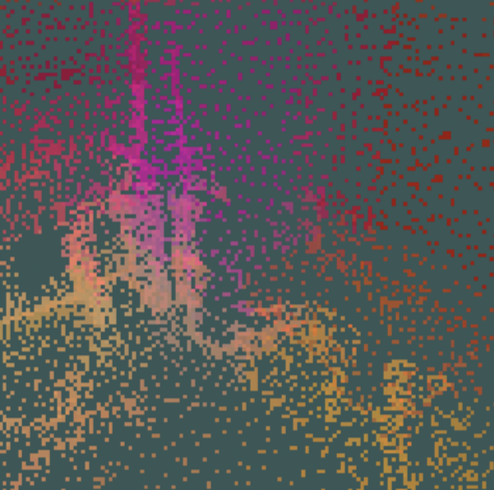
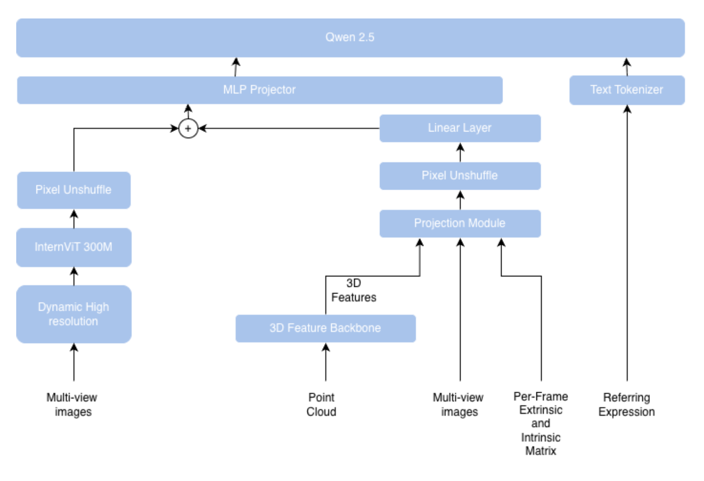

# Sa2VA-Mask3D 

## The one-sentence version

Sa2VA lets you say *"the chair next to the window"* and get back a mask of that
object in a video. We wanted the same thing in 3D, so we took Sa2VA and swapped
out its 2D mask generator (SAM2) for **Mask3D**, which works on point clouds.


An example of a 3D Referring Expression and segmentation mask pair

## What's new 

Mask3D is normally used as a *proposal generator*: it spits out a fixed number of segmentation masks for 
candidate objects (say 100), and something else afterwards picks the right one.
Most 3D referring-segmentation methods work this way.
We use Mask3D as a **pure segmenter** where it is told what to
look for and returns exactly one mask. 

---

## Part 1: The MLLM (the "understanding" half)

**Inputs:** video frames, the camera pose for each frame (extrinsics + intrinsics),
and the text prompt.

It follows the standard **ViT → MLP → LLM** recipe:

1. A Vision Transformer turns each frame into patch features.
2. An MLP projects those into the LLM's token space.
3. The LLM reads them alongside the text.

We only care about segmentation, so visual prompts (click/box inputs) are turned
off — though the hook is still there, which would let someone later build a single
model that does both 3D segmentation *and* question answering.

The problem: a ViT looking at flat frames has no idea about 3D geometry. That's
what the projection module fixes.

### 1.1 Projection Module — putting 3D knowledge into 2D frames

The idea is simple: **paint 3D features onto the image**.

**Step 1: get 3D features.** Run the point cloud through Mask3D's frozen backbone
(a Minkowski ResUNet). Out comes a feature vector for each of the `N` points.
The backbone gives features at several resolutions; we only take the finest one,
because coarser ones would leave the image mostly empty.

**Step 2: figure out where each 3D point lands in the image.** This is textbook
camera projection:

| Step | What happens |
|---|---|
| World → camera | Multiply by the extrinsic matrix `E = [R\|t]` (rotation + translation) |
| Camera → image plane | Multiply by the intrinsic matrix `K` (focal lengths, principal point, skew) |
| Perspective divide | Divide by depth `w` to get pixel coords `u = u'/w`, `v = v'/w` |
| Round | Snap `u, v` to the nearest whole pixel |

Now every 3D point knows which pixel it belongs to.

**Step 3: build the feature volume.** Make an empty `H × W × D_f` grid (image
height × width × feature dimension), all zeros. For every point that landed on
pixel `(u, v)`, drop its 3D feature vector into that slot. Pixels no point hit stay
zero.

Result: an image-shaped tensor carrying 3D information.

### 1.2 Pixel Unshuffle — making the sizes line up

The feature volume is at full image resolution; the ViT works on a 16×16 grid of
patches. Instead of throwing information away, we fold it into the channels:

1. **Max-pool** down to `rH_v × rW_v` (channels untouched).
2. **Stack** each `r × r` block along the channel axis → `H_v × W_v × r²D_f`.
3. **Linear projection + normalization** to match the ViT's channel count.

In our setup `r = 2` and `H_v = W_v = 16`. So: resize to 32×32, then stack each 2×2
block into one position which gives 16×16 patches with 2048 features each. 
### 1.3 Fusion

Reshape the 3D feature volume to match the ViT features and **add them together**.
with plain element-wise addition. The sum goes through the MLP into LLM
token space.

From there Sa2VA takes over. The LLM emits a `[SEG]` token, and that token's hidden
state is linearly projected from the LLM's dimension down to Mask3D's dimension.
This projected vector is the **prompt embedding** — the handoff between the two halves.






---

## Part 2: Mask3D (the "segmenting" half)

**Inputs:** the raw point cloud, plus the prompt embedding from the MLLM.

The trick: the prompt embedding *is* the instance query. Where stock Mask3D
generates ~100 queries and hopes one matches, we hand it exactly one query that
already encodes what the user asked for.

### 2.1 Query initialization

Our checkpoint was trained with **non-parametric queries**, so we keep that setting.
We modify Mask3D so it no longer generates queries at all — it only uses the one
we give it.

### 2.2 Query refinement

The query passes through Transformer decoder layers, alternating:

- **Cross-attention** against the backbone's voxel features (projected to keys and
  values `K, V ∈ R^{M_r × D_f}`), with Fourier positional encodings of the voxel
  coordinates added to the keys.
- **Self-attention** — which is degenerate with a single query, but the formulation
  is kept unchanged.

Each layer attends to a different resolution, coarse to fine.

> **A finding worth flagging:** the original Mask3D uses 3 decoder layers. We use
> **2**. With 3, the model stops picking out the target and instead segments
> *everything* in the scene.
>
> Our guess: the checkpoint was trained to refine queries initialized to **zero**.
> Our query arrives already loaded with scene and language information, and the
> extra refinement destabilizes it.

With 2 layers and 4 feature scales, one dedicated layer per scale means **8
refinement steps total**, with weights shared across the two passes.

### 2.3 Mask generation

Turning the refined query into a mask is three operations:

1. **MLP** — map the query into the same space as the finest backbone features.
2. **Dot product** — score every voxel: `s_i = ⟨F_{0,i}, h⟩`. High score = looks
   like what we're after.
3. **Sigmoid + threshold** — `m_i = σ(s_i)`, then cut at 0.5 for a binary mask.

---


## Part 3: Training objective

One combined loss, following Sa2VA:

```
L_instruction = L_text + L_mask
L_mask        = L_CE + L_DICE
```

**`L_text`** — standard negative log-likelihood over the target token sequence,
teacher-forced on previous ground-truth tokens.

**`L_CE`** — pixel-wise binary cross-entropy, averaged over all elements. Handles
per-voxel correctness.

**`L_DICE`** — measures overlap between prediction and ground truth as a whole,
with a small `ε` in numerator and denominator to avoid dividing by zero.

Why both mask losses? Cross-entropy alone struggles when the target object is a
tiny fraction of the scene — it can score well by predicting "background"
everywhere. Dice cares about the shape of the overlap, so it pushes back on that.

---
*
